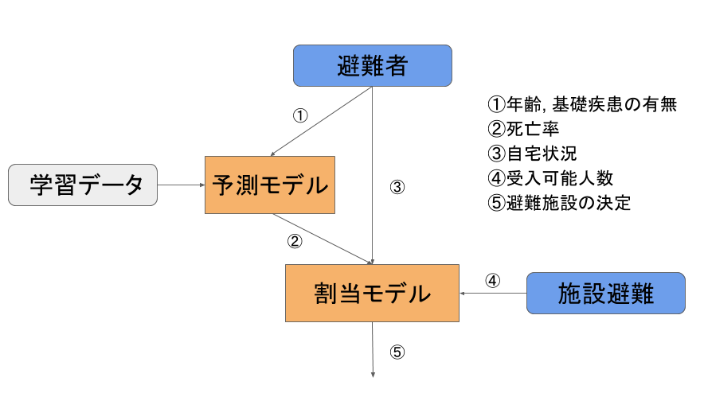

# My seneior project
[data](https://www.covidanalytics.io/dataset)

## はじめに
早急な避難の完了のため, また, 新型コロナ感染症の感染拡大の防止のためにも, なんらかの対策をとった避難所の割り当てを早急に作成する必要がある.

本研究では新型コロナ感
染症蔓延禍の災害避難計画を作成するために, 死亡リスクの最小化を目的として, 勾配ブースティ
ング木による予測モデルの作成と制約最適化を用いた避難所割り当てモデルの提案を行う

## モデルの説明
